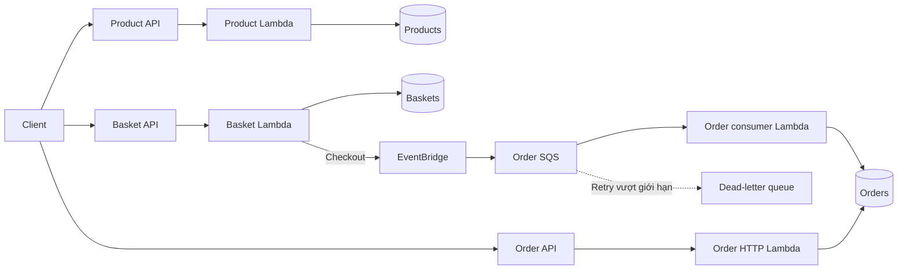
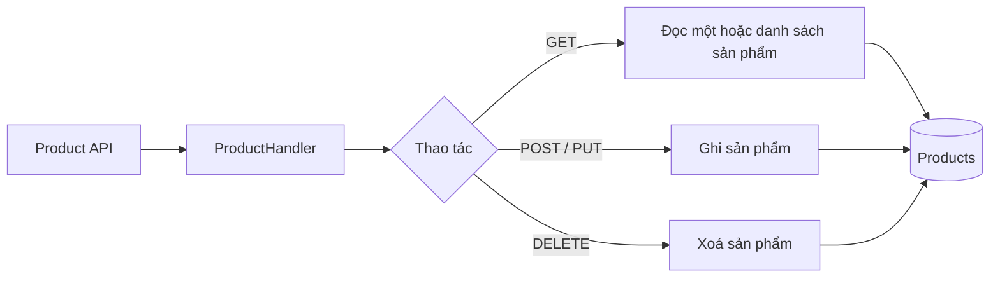
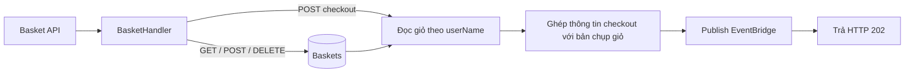
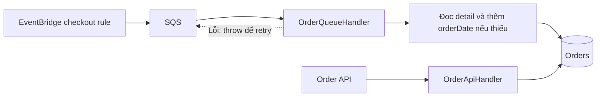

# E-commerce Backend — Java & AWS CDK

Backend thương mại điện tử serverless gồm ba dịch vụ **Product**, **Basket** và **Ordering**. Hệ thống cung cấp REST API quản lý sản phẩm, giỏ hàng và xử lý checkout bất đồng bộ trên AWS.

Mã nghiệp vụ và Infrastructure as Code viết bằng Java 21. Đây là backend API, chưa bao gồm giao diện web.

## Công nghệ

| Công nghệ | Vai trò |
|---|---|
| Java 21 | Lambda handlers và mã khai báo hạ tầng |
| Maven | Quản lý dependency, build và test |
| AWS CDK v2 Java | Mô hình hoá tài nguyên, sinh CloudFormation |
| API Gateway REST API | HTTP endpoint cho ba dịch vụ |
| AWS Lambda | Thực thi nghiệp vụ |
| DynamoDB | Lưu sản phẩm, giỏ hàng và đơn hàng |
| EventBridge | Định tuyến sự kiện checkout |
| SQS & dead-letter queue | Xử lý bất đồng bộ, retry và giữ message lỗi |
| AWS SDK for Java v2 | Truy cập DynamoDB và EventBridge |
| Jackson | Xử lý JSON |
| JUnit & CDK Assertions | Kiểm thử nghiệp vụ và cấu hình hạ tầng |
| CloudWatch Logs | Nhật ký thực thi Lambda |

Node.js/JSII là dependency của công cụ CDK; mã ứng dụng và IaC trong repository sử dụng Java.

## Kiến trúc và luồng hoạt động



Có 3 dịch vụ, 4 Lambda và 3 bảng DynamoDB. API Gateway nhận HTTP request rồi gọi Lambda; mỗi Lambda được cấp quyền với tài nguyên cần dùng.

### Product — quản lý sản phẩm



Khoá bảng là `id`. POST tự sinh UUID nếu thiếu id. POST với id trùng ghi đè; PUT thay toàn bộ item hoặc tạo mới nếu chưa tồn tại.

### Basket — giỏ hàng và checkout



Khoá bảng là `userName`; POST ghi đè giỏ. Checkout chưa xoá giỏ và vẫn chấp nhận user chưa có giỏ. Nếu EventBridge báo lỗi publish, API trả 500 thay vì 202.

### Ordering — tạo và đọc đơn hàng



EventBridge định tuyến event có source `com.ecommerce.basket.checkout`, detail type `CheckoutBasket` vào SQS. Consumer xử lý từng message, lưu order bằng cặp khoá `userName + orderDate`. Order API đọc tất cả, theo user hoặc đúng một order.

HTTP **202 chỉ xác nhận event đã được chấp nhận**; order xuất hiện sau khi consumer xử lý. SQS có visibility timeout 180 giây, maxReceiveCount 5 và DLQ giữ message lỗi 14 ngày. Retry chưa có chống trùng đơn hoàn chỉnh.

## API

Mỗi dịch vụ có một base URL riêng. Các đường dẫn dưới đây tương đối với base URL của dịch vụ tương ứng.

| API | Method và path | Thành công / không có dữ liệu |
|---|---|---|
| Product | GET /product | 200 array |
| Product | POST /product | 201 item |
| Product | GET /product/{id} | 200 / 404 |
| Product | PUT /product/{id} | 200 item |
| Product | DELETE /product/{id} | 204 |
| Basket | GET /basket | 200 array |
| Basket | POST /basket | 201 item |
| Basket | GET /basket/{userName} | 200 / 404 |
| Basket | DELETE /basket/{userName} | 204 |
| Basket | POST /basket/checkout | 202 |
| Order | GET /order | 200 array |
| Order | GET /order/{userName} | 200 array |
| Order | GET /order/{userName}?orderDate=... | 200 / 404 (cùng một route) |

Body JSON sai hoặc key không hợp lệ trả 400; lỗi hạ tầng trả 500 chung, chi tiết trong log. Unsupported route tới handler trả 405; route không khai báo ở API Gateway có thể bị chặn trước Lambda. Response 204 có body rỗng.

## Mô hình dữ liệu

| Bảng | Partition key | Sort key | Nội dung |
|---|---|---|---|
| Products | id | — | Tên, mô tả, giá và thuộc tính sản phẩm |
| Baskets | userName | — | Danh sách sản phẩm, số lượng và tổng tiền |
| Orders | userName | orderDate | Thông tin checkout và bản chụp giỏ hàng |

DynamoDB dùng chế độ on-demand. Bảng được cấu hình RETAIN. Giá dạng số thập phân được xử lý bằng BigDecimal khi chuyển đổi JSON/DynamoDB.

## Cấu trúc source

```text
pom.xml
cdk.json
services/
  src/main/java/com/ecommerce/
    shared/                  # JSON, HTTP, interface lưu trữ và DynamoDB adapter
    product/                 # ProductHandler
    basket/                  # BasketHandler, CheckoutPublisher, EventBridgePublisher
    ordering/                # OrderApiHandler, OrderQueueHandler
  src/test/                  # Kiểm thử nghiệp vụ
infrastructure/
  src/main/java/com/ecommerce/infra/
    EcommerceApp.java        # Entry point CDK Java
    EcommerceStack.java      # API, Lambda, DynamoDB, EventBridge, SQS và IAM
  src/test/                  # Kiểm thử template CDK
examples/
  checkout-events.json       # Payload mẫu EventBridge
```

Có bốn Lambda: Product, Basket, Order HTTP và Order SQS consumer. Chúng dùng chung một JAR nhưng có handler, IAM role và biến môi trường riêng. Handler nhận interface lưu trữ/publisher để kiểm thử độc lập với AWS.

## Kiểm thử và đặc điểm vận hành

- Test nghiệp vụ bao phủ CRUD, JSON không hợp lệ, checkout, chuyển đổi dữ liệu và xử lý lỗi publish/consumer.
- CDK assertions kiểm tra tài nguyên, Java runtime, IAM isolation, event pattern, retry/DLQ và retention.
- Lambda có timeout 30 giây, memory 1024 MB; log retention 7 ngày.
- Product/Basket truy cập bảng tương ứng; Order HTTP đọc đơn, consumer ghi đơn; Basket được publish vào event bus.
- Lỗi consumer được truyền ra để SQS retry, không xác nhận thành công khi ghi đơn thất bại.

## Giới hạn hiện tại

Đây là project học tập, chưa phải hệ thống production hoàn chỉnh:

- API chưa có xác thực, phân quyền hoặc CORS.
- Giá/tổng tiền vẫn nhận từ client; chưa kiểm tra đầy đủ với dữ liệu Product.
- Chưa có idempotency hoàn chỉnh, transactional outbox hoặc reservation tồn kho.
- Chưa tích hợp cổng thanh toán thật; chỉ dùng dữ liệu thử nghiệm.
- API danh sách chưa có pagination cho client; đọc toàn bộ dữ liệu có thể vượt giới hạn khi dữ liệu lớn.
- Chưa có pipeline CI/CD, load test hoặc CloudWatch alarms.

Dự án được phát triển từ một backend Node.js/CDK TypeScript đã clone, sau đó chuyển sang Java và AWS CDK Java.
